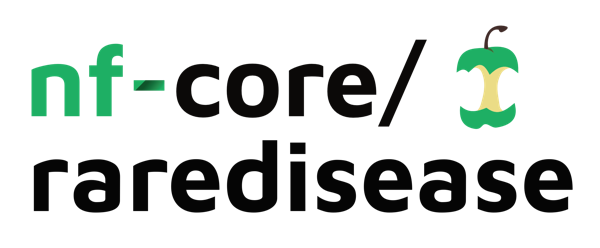
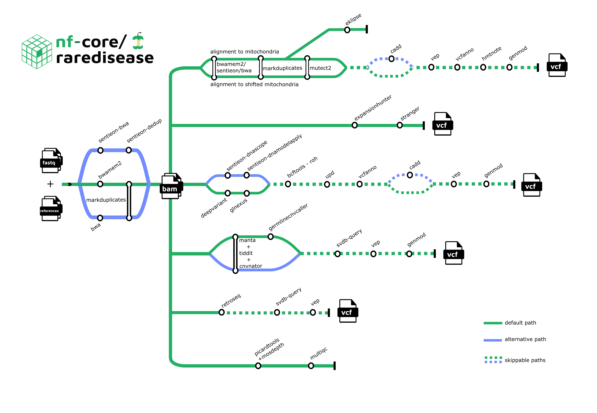

<h1>
  <picture>
    <source media="(prefers-color-scheme: dark)" srcset="docs/images/nf-core-raredisease_logo_dark.png">
    
  </picture>
</h1>
[](https://github.com/nf-core/raredisease/actions?query=workflow%3A%22nf-core+CI%22)
[](https://github.com/nf-core/raredisease/actions?query=workflow%3A%22nf-core+linting%22)[](https://nf-co.re/raredisease/results)[](https://doi.org/10.5281/zenodo.7995798)

[](https://www.nextflow.io/)
[](https://docs.conda.io/en/latest/)
[](https://www.docker.com/)
[](https://sylabs.io/docs/)
[](https://tower.nf/launch?pipeline=https://github.com/nf-core/raredisease)

[](https://nfcore.slack.com/channels/raredisease)[](https://twitter.com/nf_core)[](https://mstdn.science/@nf_core)[](https://www.youtube.com/c/nf-core)

#### TOC

- [Introduction](#introduction)
- [Pipeline summary](#pipeline-summary)
- [Usage](#usage)
- [Pipeline output](#pipeline-output)
- [Credits](#credits)
- [Contributions and Support](#contributions-and-support)
- [Citations](#citations)

## Introduction

**nf-core/raredisease** is a best-practice bioinformatic pipeline for calling and scoring variants from WGS/WES data from rare disease patients. This pipeline is heavily inspired by [MIP](https://github.com/Clinical-Genomics/MIP).

The pipeline is built using [Nextflow](https://www.nextflow.io), a workflow tool to run tasks across multiple compute infrastructures in a very portable manner. It uses Docker/Singularity containers making installation trivial and results highly reproducible. The [Nextflow DSL2](https://www.nextflow.io/docs/latest/dsl2.html) implementation of this pipeline uses one container per process which makes it much easier to maintain and update software dependencies. Where possible, these processes have been submitted to and installed from [nf-core/modules](https://github.com/nf-core/modules) in order to make them available to all nf-core pipelines, and to everyone within the Nextflow community!

On release, automated continuous integration tests run the pipeline on a full-sized dataset on the AWS cloud infrastructure. This ensures that the pipeline runs on AWS, has sensible resource allocation defaults set to run on real-world datasets, and permits the persistent storage of results to benchmark between pipeline releases and other analysis sources. The results obtained from the full-sized test can be viewed on the [nf-core website](https://nf-co.re/raredisease/results).

## Pipeline summary

<p align="center">
    
</p>

**1. Metrics:**

- [FastQC](https://www.bioinformatics.babraham.ac.uk/projects/fastqc/)
- [Mosdepth](https://github.com/brentp/mosdepth)
- [MultiQC](http://multiqc.info/)
- [Picard's CollectMutipleMetrics, CollectHsMetrics, and CollectWgsMetrics](https://broadinstitute.github.io/picard/)
- [Qualimap](http://qualimap.conesalab.org/)
- [Sentieon's WgsMetricsAlgo](https://support.sentieon.com/manual/usages/general/)
- [TIDDIT's cov](https://github.com/J35P312/)

**2. Alignment:**

- [Bwa-mem2](https://github.com/bwa-mem2/bwa-mem2)
- [BWA](https://github.com/lh3/bwa)
- [Sentieon DNAseq](https://support.sentieon.com/manual/DNAseq_usage/dnaseq/)

**3. Variant calling - SNV:**

- [DeepVariant](https://github.com/google/deepvariant)
- [Sentieon DNAscope](https://support.sentieon.com/manual/DNAscope_usage/dnascope/)

**4. Variant calling - SV:**

- [Manta](https://github.com/Illumina/manta)
- [TIDDIT's sv](https://github.com/SciLifeLab/TIDDIT)
- Copy number variant calling:
  - [CNVnator](https://github.com/abyzovlab/CNVnator)
  - [GATK GermlineCNVCaller](https://github.com/broadinstitute/gatk)

**5. Annotation - SNV:**

- [bcftools roh](https://samtools.github.io/bcftools/bcftools.html#roh)
- [vcfanno](https://github.com/brentp/vcfanno)
- [CADD](https://cadd.gs.washington.edu/)
- [VEP](https://www.ensembl.org/info/docs/tools/vep/index.html)
- [UPD](https://github.com/bjhall/upd)
- [Chromograph](https://github.com/Clinical-Genomics/chromograph)

**6. Annotation - SV:**

- [SVDB query](https://github.com/J35P312/SVDB#Query)
- [VEP](https://www.ensembl.org/info/docs/tools/vep/index.html)

**7. Mitochondrial analysis:**

- [Alignment and variant calling - GATK Mitochondrial short variant discovery pipeline ](https://gatk.broadinstitute.org/hc/en-us/articles/4403870837275-Mitochondrial-short-variant-discovery-SNVs-Indels-)
- [eKLIPse](https://github.com/dooguypapua/eKLIPse/tree/master)
- Annotation:
  - [HaploGrep2](https://github.com/seppinho/haplogrep-cmd)
  - [Hmtnote](https://github.com/robertopreste/HmtNote)
  - [vcfanno](https://github.com/brentp/vcfanno)
  - [CADD](https://cadd.gs.washington.edu/)
  - [VEP](https://www.ensembl.org/info/docs/tools/vep/index.html)

**8. Variant calling - repeat expansions:**

- [Expansion Hunter](https://github.com/Illumina/ExpansionHunter)
- [Stranger](https://github.com/Clinical-Genomics/stranger)

**9. Variant calling - mobile elements:**

- [RetroSeq](https://github.com/tk2/RetroSeq)

**10. Rank variants - SV and SNV:**

- [GENMOD](https://github.com/Clinical-Genomics/genmod)

**11. Variant evaluation:**

- [RTG Tools](https://github.com/RealTimeGenomics/rtg-tools)

Note that it is possible to include/exclude certain tools or steps.

## Usage

> [!NOTE]
> If you are new to Nextflow and nf-core, please refer to [this page](https://nf-co.re/docs/usage/installation) on how to set-up Nextflow. Make sure to [test your setup](https://nf-co.re/docs/usage/introduction#how-to-run-a-pipeline) with `-profile test` before running the workflow on actual data.

First, prepare a samplesheet with your input data that looks as follows:

`samplesheet.csv`:

```csv
sample,lane,fastq_1,fastq_2,sex,phenotype,paternal_id,maternal_id,case_id
hugelymodelbat,1,reads_1.fastq.gz,reads_2.fastq.gz,1,2,,,justhusky
```

Each row represents a fastq file (single-end) or a pair of fastq files (paired end).

Second, ensure that you have defined the path to reference files and parameters required for the type of analysis that you want to perform. More information about this can be found [here](https://github.com/nf-core/raredisease/blob/dev/docs/usage.md).

Now, you can run the pipeline using:

```bash
nextflow run nf-core/raredisease \
   -profile <docker/singularity/podman/shifter/charliecloud/conda/institute> \
   --input samplesheet.csv \
   --outdir <OUTDIR>
```

> [!WARNING]
> Please provide pipeline parameters via the CLI or Nextflow `-params-file` option. Custom config files including those provided by the `-c` Nextflow option can be used to provide any configuration _**except for parameters**_;
> see [docs](https://nf-co.re/usage/configuration#custom-configuration-files).

For more details and further functionality, please refer to the [usage documentation](https://nf-co.re/raredisease/usage) and the [parameter documentation](https://nf-co.re/raredisease/parameters).

## Pipeline output

For more details about the output files and reports, please refer to the
[output documentation](https://nf-co.re/raredisease/output).

## Credits

nf-core/raredisease was written in a collaboration between the Clinical Genomics nodes in Sweden, with major contributions from [Ramprasad Neethiraj](https://github.com/ramprasadn), [Anders Jemt](https://github.com/jemten), [Lucia Pena Perez](https://github.com/Lucpen), and [Mei Wu](https://github.com/projectoriented) at Clinical Genomics Stockholm.

Additional contributors were [Sima Rahimi](https://github.com/sima-r), [Gwenna Breton](https://github.com/Gwennid) and [Emma Västerviga](https://github.com/EmmaCAndersson) (Clinical Genomics Gothenburg); [Halfdan Rydbeck](https://github.com/hrydbeck) and [Lauri Mesilaakso](https://github.com/ljmesi) (Clinical Genomics Linköping); [Subazini Thankaswamy Kosalai](https://github.com/sysbiocoder) (Clinical Genomics Örebro); [Annick Renevey](https://github.com/rannick) and [Peter Pruisscher](https://github.com/peterpru) (Clinical Genomics Stockholm); [Ryan Kennedy](https://github.com/ryanjameskennedy) (Clinical Genomics Lund); [Anders Sune Pedersen](https://github.com/asp8200) (Danish National Genome Center) and [Lucas Taniguti](https://github.com/lmtani).

We thank the nf-core community for their extensive assistance in the development of this pipeline.

## Contributions and Support

If you would like to contribute to this pipeline, please see the [contributing guidelines](.github/CONTRIBUTING.md).

For further information or help, don't hesitate to get in touch on the [Slack `#raredisease` channel](https://nfcore.slack.com/channels/raredisease) (you can join with [this invite](https://nf-co.re/join/slack)).

## Citations

If you use nf-core/raredisease for your analysis, please cite it using the following doi: [10.5281/zenodo.7995798](https://doi.org/10.5281/zenodo.7995798)

An extensive list of references for the tools used by the pipeline can be found in the [`CITATIONS.md`](CITATIONS.md) file.

You can cite the `nf-core` publication as follows:

> **The nf-core framework for community-curated bioinformatics pipelines.**
>
> Philip Ewels, Alexander Peltzer, Sven Fillinger, Harshil Patel, Johannes Alneberg, Andreas Wilm, Maxime Ulysse Garcia, Paolo Di Tommaso & Sven Nahnsen.
>
> _Nat Biotechnol._ 2020 Feb 13. doi: [10.1038/s41587-020-0439-x](https://dx.doi.org/10.1038/s41587-020-0439-x).

You can read more about MIP's use in healthcare in,

> Stranneheim H, Lagerstedt-Robinson K, Magnusson M, et al. Integration of whole genome sequencing into a healthcare setting: high diagnostic rates across multiple clinical entities in 3219 rare disease patients. Genome Med. 2021;13(1):40. doi:10.1186/s13073-021-00855-5
